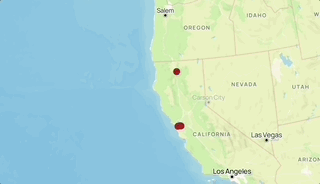

# "The Places That I Have Been To" App

## What did I build? And Who did I build this for?
["The Places That I Have Been To" App](https://rodolfolightning.github.io/My-Life-Map/)  is a HIGHLY Interactive map in which you are given the full ability to view My own map markers. This is mainly built for those that are curious about making a digital map, Or for those that would like to know me as a person. The way this map works is it uses markers that I have made to suggest places that I have visited personally.

Here's a demo:

## Why did I build this?
When I decided to create this map I wanted people to:

1. Learn a lot about me entirely
2. Learn how to utilize this map 
3. Use code for your own benefits.

This was a very beautifully made assignment, I believe many can learn from my works.

## Tech stack
To build this app, I used the following tools:

1. [Google My Maps](https://www.google.com/maps/d/u/0/), Helps me evaluate my map.
2. [Mapbox GL JS](https://docs.mapbox.com/mapbox-gl-js/guides), helps documentize my work and keep it safe.
3. [Visual Studio Code](https://code.visualstudio.com/download) free IDE, with [Live Server](https://marketplace.visualstudio.com/items?itemName=ritwickdey.LiveServer) and [Markdown All in One](https://marketplace.visualstudio.com/items?itemName=yzhang.markdown-all-in-one) extensions.
4. [GitHub pages](https://docs.github.com/en/pages/getting-started-with-github-pages/creating-a-github-pages-site), This helps publicize my work for people to see or take clear inspiration of.

## Feature Spotlight
The click-interaction displays a popup with an image, title, and description for each map marker. I find the seamless integration of imahes compelling. Intially the popups failed because the image property wasn't correctly referenced in the GEOJSON. I learned how dynamically construct HTML content within a Mapboc popup by pulling data directly from a feature's properties.

_This made my map all the more fun to create_
## Contributions
I warmly welcome feedback, bug reports, and feature suggestiosn from users to help improve the project. A special thanks to @domlet for the original repository; forking was a great demonstration of the collaborative, open-source spirit.
Imagine mapping Oakland's historic landmarks or creating the ultimate Bay Area Burrito Finder! You have everything you need. Feel free to fork this code, swap in your own dataset of favorite spots, and create your own interactive story map!
